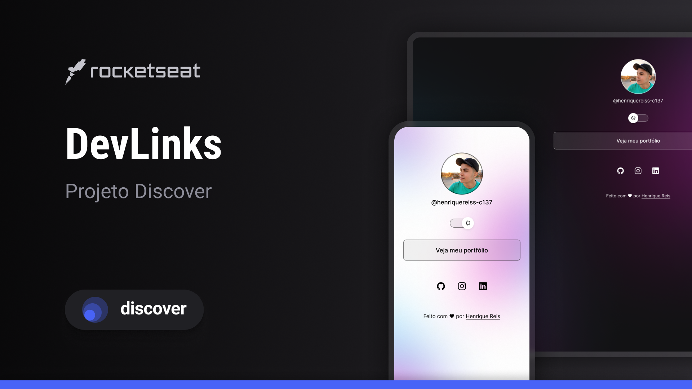

<h1 align="center">🔗DevLinks</h1>

Um agregador de links e cartão de visita virtual

 

  Acesse o projeto clickando <a>aqui</a> 
  Projeto desenvolvido com o acompanhamento do <b>Discover</b>, o curso gratuito de programação web da <a href="https://rocketseat.com.br/">Rocketseat</a>.

<h2>💻 Tecnologias</h2>
<ul>
  <li>HTML</li>
  <li>CSS</li>
  <li>Javascript</li>
  <li>Git</li>
</ul>
