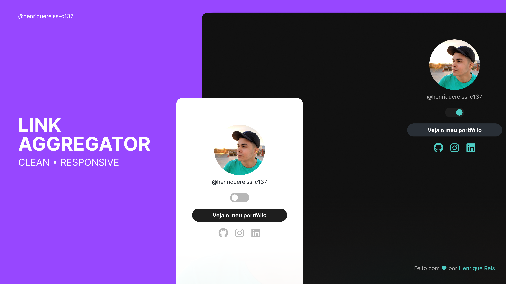

<h1 align="center">🔗 My Links</h1>

Esse é o meu agregador de links!

 
 

  Acesse o projeto clickando <a href="https://henriquereiss-c137.github.io/DevLinks/" target="_blank">aqui</a> 👈

<h2>💻 Tecnologias</h2>
<ul>
  <li>HTML</li>
  <li>CSS</li>
  <li>Javascript</li>
  <li>Git</li>
</ul>
